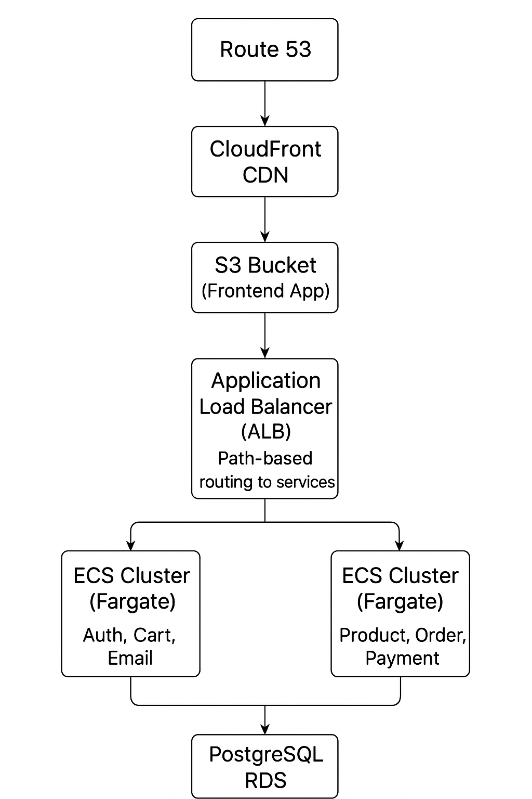

# 🛒 QuickCart - Full Stack E-commerce Application (DevOps + AWS)

## 1. Project Overview

**QuickCart** is a full-stack e-commerce application deployed on **AWS** using modern **DevOps** practices.

### 🚀 Key Features

- **Serverless Frontend**: Hosted on **S3 + CloudFront**
- **Backend Microservices** (Node.js):  
  `auth`, `product`, `cart`, `order`, `payment`, `email`
- **Database**: PostgreSQL on AWS RDS
- **Frontend**: React.js (Customer site + Admin dashboard)
- **Containerized Backend**: Each service build in Docker as image push ecr  and deployed to **ECS Fargate** 
- **Routing**: Path-based API routing using **Application Load Balancer (ALB)**
- **CI/CD**: Jenkins + Terraform automate build and deployment
- **Images stored in**: AWS ECR
- **Domain managed by**: AWS Route 53

---

## 2. Architecture Diagram




---

## 3. CI/CD Pipeline

### ⚙️ Workflow

#### **Build Stage (Jenkins)**
1. Pull backend (Node.js) code from GitHub  
2. Build Docker images for microservices (auth, product, cart, order, payment, email)  
3. Pull frontend (React.js) code  
4. Build React frontend app  

#### **Push Stage**
5. Push backend Docker images to **AWS ECR**  
6. Deploy frontend build to **S3 Bucket**

#### **Deploy Stage (Terraform)**
7. Deploy ECS Fargate services with new Docker images  
8. Configure **ALB** for path-based routing  
9. Deploy **CloudFront + S3** for frontend  
10. Provision **Security Groups**, **IAM roles**, and **RDS PostgreSQL**

#### **End Result**
- Frontend served via **CloudFront + S3**  
- Backend microservices running on **ECS Fargate (via ALB)**  
- Full automation through Jenkins and Terraform  

---

## 4. Technologies Used

| Category | Tools / Services |
|-----------|------------------|
| **Backend** | Node.js, Express.js, Docker |
| **Frontend** | React.js |
| **Containerization** | Docker, AWS ECR |
| **Orchestration** | AWS ECS Fargate |
| **Load Balancing** | AWS ALB |
| **Database** | AWS RDS (PostgreSQL) |
| **Hosting** | AWS S3 + CloudFront |
| **DNS** | AWS Route 53 |
| **CI/CD** | Jenkins, Terraform |
| **Security** | IAM Roles, Security Groups, VPC, Subnets, NAT |

---

## 5. Security & Networking

- **VPC**: Private subnets for ECS tasks and RDS  
- **Security Groups**: Restrict inbound/outbound traffic  
- **IAM Roles**: ECS tasks use roles to access AWS services  
- **HTTPS**: Enabled via CloudFront + ALB  
- **Database Security**: PostgreSQL RDS accessible only from ECS  

---

## 6. Application Flow

1. User accesses frontend (customer/admin)
2. Frontend requests → **CloudFront CDN → S3 bucket**
3. API requests → **ALB**
4. ALB routes request to correct **ECS Fargate service**
5. Microservices interact with **RDS PostgreSQL**
6. Response → ALB → CloudFront → User  

---

## 7. Future Enhancements

- Enable **autoscaling** for ECS services  
- Add **monitoring/logging** with CloudWatch or ELK stack  
- Modularize Terraform scripts for reusability  
- Integrate **automated tests** in Jenkins  

---

## 8. Deployment Architecture / Infrastructure Details

### **Frontend Deployment**
- React app built and uploaded to **S3**
- **CloudFront CDN** serves globally
- Custom domain via **Route 53**

### **Backend Deployment**
- Node.js microservices containerized with **Docker**
- Pushed to **AWS ECR**
- **ECS Fargate** launches containers
- **ALB** handles path-based routing

### **Database Deployment**
- **PostgreSQL RDS** in private subnet
- Only accessible from ECS via **Security Groups**

### **CI/CD Integration**
- Jenkins automates build & deploy
- Terraform provisions infrastructure (ECS, ALB, RDS, S3, IAM, SGs)

### **Security & Networking**
- VPC with private/public subnets
- IAM roles for ECS tasks and Jenkins
- HTTPS via ALB + CloudFront

---

## 9. Summary / Conclusion

### **QuickCart Overview**
- Full-stack, serverless-ready e-commerce app on AWS  
- Microservices backend + React frontend  

### **Key Achievements**
- Serverless frontend (S3 + CloudFront)
- ECS Fargate backend (no servers to manage)
- Jenkins + Terraform automate CI/CD
- Strong security (IAM, SGs, private RDS)

### **Learnings**
- Hands-on AWS ECS, ALB, RDS, CloudFront, Route 53, ECR
- Path-based routing, IaC with Terraform, DevOps automation

### **Future Enhancements**
- Autoscaling ECS
- Add ELK/CloudWatch monitoring
- Modular Terraform
- CI/CD testing automation

---

## ⚙️ Jenkins EC2 Setup (Amazon Linux 2023)

You can use `t3.small` EC2 instance for Jenkins.  
Commands below assume **Amazon Linux 2023** (adjust if using Ubuntu/RHEL).

---

### 1️⃣ AWS CLI (already installed)
```bash
aws --version
# If not installed
curl "https://awscli.amazonaws.com/awscli-exe-linux-x86_64.zip" -o "awscli.zip"
unzip awscli.zip
sudo ./aws/install

### 2️⃣ Terraform
sudo dnf install -y dnf-plugins-core
sudo dnf config-manager --add-repo https://rpm.releases.hashicorp.com/AmazonLinux/hashicorp.repo
sudo dnf -y install terraform
terraform -version

### 3️⃣ Docker
sudo yum update -y
sudo yum install -y docker
sudo service docker start
sudo usermod -aG docker jenkins
docker -v

### 4️⃣ kubectl (Kubernetes CLI)
curl -O https://s3.us-west-2.amazonaws.com/amazon-eks/1.34.1/2025-09-19/bin/linux/amd64/kubectl
chmod +x ./kubectl
sudo mv ./kubectl /usr/local/bin/
kubectl version --client

### 5️⃣ Helm (Kubernetes Package Manager)
curl https://raw.githubusercontent.com/helm/helm/main/scripts/get-helm-3 | bash
helm version

### 6️⃣ Node.js
sudo yum install -y gcc-c++ make 
curl -sL https://rpm.nodesource.com/setup_21.x | sudo -E bash -
sudo yum install -y nodejs
node -v

### 7️⃣ Git
sudo dnf update
sudo dnf install git -y
git --version
### 8️⃣ Jenkins
sudo dnf update -y
sudo dnf install java-17-amazon-corretto -y

sudo wget -O /etc/yum.repos.d/jenkins.repo \
    https://pkg.jenkins.io/redhat-stable/jenkins.repo

sudo rpm --import https://pkg.jenkins.io/redhat-stable/jenkins.io-2023.key
sudo dnf install jenkins -y

sudo systemctl enable jenkins
sudo systemctl start jenkins
sudo systemctl status jenkins


🔹 Get password:

sudo cat /var/lib/jenkins/secrets/initialAdminPassword


Open http://<public-ip>:8080 in browser and log in using that password.
Make sure port 8080 is open in your EC2 security group.

### 9️⃣ Jenkins Plugins to Install

AWS Credentials

Amazon ECR

Amazon ECS / Fargate

Pipeline: AWS Steps

Pipeline: Stage View

Docker Pipeline

Webhook Step

Git Server

Kubernetes Credentials

Kubernetes

Kubernetes CLI

GitHub Integration

### 🔟 Add AWS Credentials to Jenkins

Go to:
Dashboard → Manage Jenkins → Credentials → Global → Add Credentials

Kind: AWS Credentials

ID: aws-creds-id

Add Access Key ID and Secret Key

### 11 create a stripe secrete key and public key using stripe board and alsi there only create webhook 

